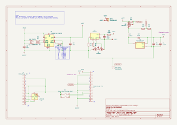
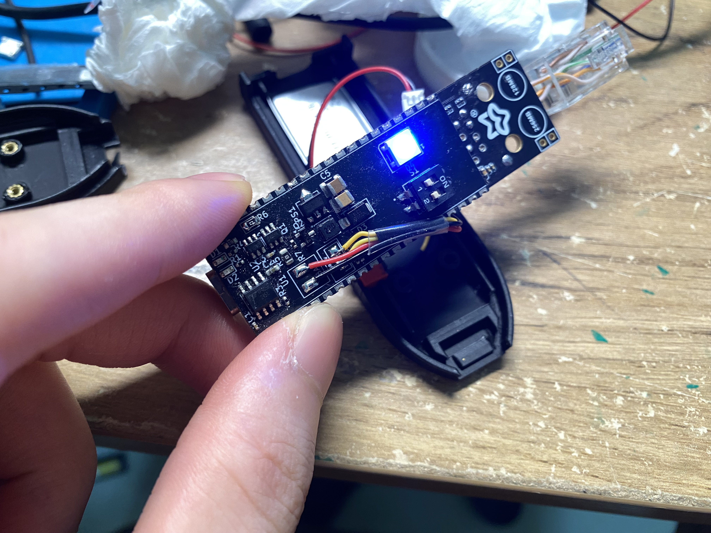

# FOX-JACK\_EXT\_BOARD

This directory contains the optional open-source extension board for the Fox-Jack project.

The design follows a **stacked PCB layout**, inspired by iPhone-style modularity. It provides improved mechanical fit and a clean interface with the Luckfox Pico Max board.

---

## Structure

The extension board consists of two stacked PCB parts:

### 1. **FOX-JACK\_EXT\_BOARD\_TOP**

* Main extension board
* PCB thickness: **0.8mm**
* Contains most components (battery management, NeoPixel, etc.)

### 2. **FOX-JACK\_EXT\_BOARD\_MID**

* Acts as the mechanical connector/base
* PCB thickness: **1.6mm**
* Slots perfectly between the TOP board and the Luckfox Pico Max
* Helps mechanically solder and support stacking alignment

> ⚙️ This stacking approach allows a compact and professional fit, while still being low-cost and DIY-friendly.

---

## PCB Manufacturing Notes (e.g., JLCPCB)

When ordering the extension board from **JLCPCB** (or similar vendors):

* ❗ **Do NOT enable “Castellated Holes”**  — leave this option **off**
* ✅ This will keep the board cost around **\$4 USD**
* ❌ Enabling Castellated Holes will raise the quote to **\$40+ USD**

This design does not require plated edge connections; solder bridges on the side pads will provide strong enough mechanical connection and electrical continuity.

---

## Files Provided

* **KiCad Project Files** (`.kicad_pcb`, `.sch`, etc.)
* **Gerber Output** for manufacturing
* **BOM (Bill of Materials)**
* **Assembly Notes** for DIY soldering (if required)

All files are licensed under **GPLv3** and open for community use, study, and modification.
